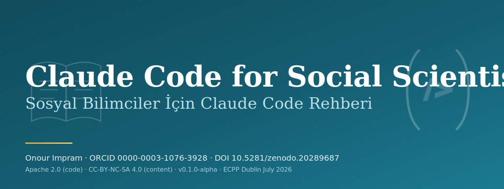

<p align="center">
  
</p>

# Claude Code for Social Scientists

A bilingual, open-source guide for social scientists who want to use Anthropic's Claude Code in their research, teaching, and academic writing. Written for researchers outside the English-speaking world as well as inside it, by a working clinical psychologist and PhD candidate who uses these tools in real academic production.

> **Status:** v2.2.0 release. Thirteen released booklets in Turkish and English, human-reviewed and citation-audited, plus ten companion Claude Code project skills that turn the booklets into reusable workflows. v2.2.0 adds a second Data Analysis booklet, Statistical Test Selection with AI Consultation Discipline, on choosing tests when an agent can run any of them instantly, a direct answer to the survey's named fear of selective reporting. The skills install with pip (`social-cc-plugin`) or as a Claude Code plugin.

> **TR readers:** A Turkish overview lives at the bottom of this file. The full Turkish version is in [`README.tr.md`](./README.tr.md). Every booklet exists as `tr.md` and `en.md` side by side.

---

## What this guide is

A practical, evidence-led handbook for using Claude Code in academic work that is not in computer science. The audience is researchers in psychology, sociology, education, public health, communication, political science, anthropology, and adjacent fields. Every booklet is delivered in Turkish and English in full parallel.

The guide covers, across twelve thematic categories, the questions a social scientist actually faces:

1. **Foundations.** What Claude Code is, how it differs from a chat window, where it earns its keep in scholarly work.
2. **Academic access.** PubMed and Semantic Scholar MCPs, EZproxy and institutional VPN realities, ORCID, Zotero, DergiPark, ULAKBIM TR Dizin, HEAL-Link.
3. **Memory systems.** Long-running vaults, persistent context, retrieval over a decade of notes, the Memory-as-Vault engineering pattern.
4. **Vault architecture.** Folder discipline, MOCs (Maps of Content), Markdown conventions that survive software changes.
5. **Hooks and automation.** Session lifecycle events, ritual hooks, lightweight CI for personal knowledge bases.
6. **MCP and plugins.** Authoring, auditing, and curating Model Context Protocol servers for academic workflows.
7. **Academic writing.** IMRAD scaffolding in Turkish and English, APA 7 with DOI discipline, journal fit, manuscript revision.
8. **Data analysis.** Reproducible workflows, statistical test selection, qualitative coding, mixed-methods discipline.
9. **Ethics and IRB.** Helsinki Declaration, COPE, WAME, ICMJE, STM 2025, EU AI Act 2024/1689 Art. 50, ENAI, KVKK, GDPR.
10. **Peer review.** Rebuttal letters with traceability matrices, reviewer-response discipline, anti-AI-trace writing.
11. **Conference presentation.** Slides, posters, lightning talks, networking sequences.
12. **Troubleshooting.** When tools fail, when papers disagree, when reviewers ask the wrong question.

Each booklet is short, opinionated, and tested in the author's own academic practice.

## Why bilingual

Turkish and English are presented in full parallel. There are roughly ninety million Turkish speakers globally and a large diaspora in Western Europe, and Turkish-language academic AI resources are scarce relative to demand. This gap is not incidental. A large 2026 survey of coding agents in the social sciences samples researchers in the United States and Canada and finds adoption skewed by career stage, gender, and institutional prestige ([Anthropic, 2026](https://www.anthropic.com/research/coding-agents-social-sciences)). A guide written in full parallel from outside that frame is one concrete way to widen access. The English version exists so the work is reviewable by international colleagues, citable in English-language journals, and reachable through global academic search engines. Each booklet lives in a folder with `tr.md` and `en.md` as siblings. A continuous-integration check refuses any commit that breaks this pairing.

## Who this is for, who it is not

It is for the assistant professor running a survey study, the PhD student writing a systematic review, the postdoc preparing an R&R, the lecturer designing a syllabus, the clinical researcher navigating IRB. It is for people who can read code but who do not want to spend a week learning a new toolchain to write one paragraph.

It is not a Claude Code reference manual (Anthropic publishes those). It is not an AI hype document. It does not promise that AI will write your paper for you. It also does not pretend AI plays no role in academic work in 2026; the position is honest co-authorship under the consolidating publishing consensus on AI disclosure (COPE 2023, WAME 2023, ICMJE 2024, STM 2025) and the transparency obligations of the EU AI Act 2024/1689.

## Authorship and AI co-authorship

The author is Onour Impram, a clinical psychologist licensed in Türkiye, Greece, and Ireland, a PhD candidate in Clinical and Health Psychology at Istanbul University, an external lecturer at Biruni University, and an AI and mental health researcher. ORCID: [0000-0003-1076-3928](https://orcid.org/0000-0003-1076-3928).

Claude Code is used as a drafting and verification assistant. Each booklet carries a frontmatter block declaring the contribution level (`ai_assisted`, `ai_tools.model_alias`, `ai_tools.model_dated`, `ai_contribution_level`, `human_review`) in the spirit of the consolidating publishing consensus on AI disclosure (COPE 2023, WAME 2023, ICMJE 2024, STM 2025) combined with EU AI Act 2024/1689 Article 50 transparency obligations and ENAI recommendations on the ethical use of AI in research. See [`AI-AUTHORSHIP.md`](./AI-AUTHORSHIP.md) for the full policy.

## Repository layout

```
claude-code-for-social-scientists/
├── README.md                  (this file, EN)
├── README.tr.md               (TR main)
├── LICENSE                    (dual-license header)
├── LICENSE.code               (Apache 2.0 full text)
├── LICENSE.content            (CC-BY-NC-SA 4.0 full text)
├── CITATION.cff               (Zenodo concept DOI: 10.5281/zenodo.20289687)
├── AI-AUTHORSHIP.md           (disclosure policy)
├── CATALOG.md                 (catalog of all planned and drafted booklets)
├── package.json               (local lint and validation commands)
├── CODE_OF_CONDUCT.md
├── CONTRIBUTING.md            (EN)
├── CONTRIBUTING.tr.md         (TR)
├── .claude/
│   └── skills/                (project skills for Claude Code)
├── booklets/
│   ├── 001-foundations/
│   ├── 002-academic-access/
│   ├── ... (012 categories)
├── template/                  (booklet starter templates)
├── meta/
│   ├── roadmap.md
│   ├── contributors.md
│   └── ai-disclosure.md
├── scripts/
│   ├── README.md
│   └── validate-repo.mjs
└── .github/
    └── workflows/
        ├── ci.yml             (markdownlint + repo integrity validation)
        ├── citation-check.yml (cff-validator)
        └── secret-scan.yml    (gitleaks)
```

## Cataloging convention

Each booklet has a stable identifier of the form `KKK-AA-SSSS`:

- `KKK` is the three-digit category code (001 to 012).
- `AA` is a two-digit subcategory code within the category.
- `SSSS` is a four-digit serial number.

So `001-01-0001` is the first booklet, in the first subcategory, of the Foundations category. The full catalog lives in [`CATALOG.md`](./CATALOG.md). Identifiers do not change after release, even if the booklet is later revised; revisions are tracked in the booklet's own frontmatter and changelog.

## Project Skills

The v2.2.0 surface includes ten Claude Code project skills under [`.claude/skills/`](./.claude/skills/). The booklets carry theory, pedagogy, and scholarly framing. The skills carry repeatable workflows, audit checklists, and safe operating boundaries.

| Skill | Companion booklets | Purpose |
|---|---|---|
| `social-science-literature-triage` | 002, 007 | Scope database selection, language layers, DOI status, and inclusion criteria before a review starts. |
| `apa-doi-verifier` | 007 | Clean APA 7 references, check DOI metadata, and classify fabricated citation risk. |
| `bilingual-booklet-pairing` | all booklet pairs | Check `tr.md` and `en.md` parity, frontmatter alignment, headings, and adaptation notes. |
| `ai-disclosure-auditor` | all booklet pairs | Audit AI contribution fields, human review, citation counts, model metadata, and disclosure standard. |
| `ethics-irb-ai-protocol` | 009 | Produce ethics, KVKK, GDPR, EU AI Act, disclosure, and data-minimization checklists. |
| `rebuttal-traceability-matrix` | 010 | Convert reviewer comments into response categories, manuscript change mapping, and editor reply drafts. |
| `memory-vault-architect` | 003, 004 | Design research vault folders, MOCs, frontmatter, source passports, and retrieval patterns. |
| `regional-access-workflow` | 002 | Plan lawful access through DergiPark, ULAKBIM TR Dizin, HEAL-Link, YOK Thesis Center, VPN, and library routes. |
| `agentic-session-debugger` | 012 | Diagnose Claude Code scope drift, loop traps, hidden state, context limits, PATH, and permission failures. |
| `repo-release-integrity-check` | whole repository | Check README, catalog, changelog, citation files, Zenodo DOI, release notes, AI disclosure, and booklet metadata before release. |

### Installing the skills

The skills ship two ways, and both read from the same `.claude/skills/` source.

- **pip.** Run `pip install social-cc-plugin`, then `social-cc install` to copy the skills into your Claude configuration. Use `social-cc install --project` to write them into the current project's `.claude/skills/` instead, and `social-cc list` to see what is bundled.
- **Claude Code plugin.** Install the repository through the Claude Code plugin system. The manifest at [`.claude-plugin/plugin.json`](./.claude-plugin/plugin.json) exposes the same skills.

The installer code is Apache 2.0. The skill content it copies stays under CC-BY-NC-SA 4.0, so the non-commercial and attribution terms apply to the prose. See [Licensing](#licensing).

## Licensing

Code and configuration are under the **Apache License, Version 2.0** ([`LICENSE.code`](./LICENSE.code)). Booklets, guides, prose, and instructional content are under **Creative Commons Attribution-NonCommercial-ShareAlike 4.0 International** ([`LICENSE.content`](./LICENSE.content)). The dual-license model is summarized in [`LICENSE`](./LICENSE) at the repository root. Commercial use of the prose content requires prior written permission; see the LICENSE file for the contact procedure.

## Citation

If you cite this work, use the machine-readable record in [`CITATION.cff`](./CITATION.cff), or the "Cite this repository" button on GitHub. The Zenodo concept DOI (resolves to the latest version) is **10.5281/zenodo.20289687**. See <https://doi.org/10.5281/zenodo.20289687> for the canonical record. Zenodo mints each version DOI after a GitHub release is published, so immutable tag archives may only contain the concept DOI and previously known version DOIs. Newly minted version DOI metadata is recorded on `main` after Zenodo creates it.

## International protection

This work is registered through:

- **Zenodo** (CERN) for a persistent DOI on each release
- **Software Heritage Archive** (CERN/Inria) for a permanent code archive
- **U.S. Copyright Office (eCO)** for an evidentiary registration enforceable in 180+ Berne Convention member states
- **Creative Commons license metadata** for machine-readable license declarations

## Roadmap

See [`meta/roadmap.md`](./meta/roadmap.md) for the public phase plan. The current release is v2.2.0, which adds a second Data Analysis booklet (Statistical Test Selection with AI Consultation Discipline) on top of the twelve booklets and ten companion project skills shipped through v2.1.0. A later major milestone, the full thirty-booklet catalog with a living lab, conference citations, and instructional use, is targeted for v3.0.

## Contributing

Contributions are welcome from social science researchers, clinicians, instructional designers, librarians, and engineers who care about how AI lands in non-English academic ecosystems. See [`CONTRIBUTING.md`](./CONTRIBUTING.md) (or [`CONTRIBUTING.tr.md`](./CONTRIBUTING.tr.md)) for the pull request workflow, the bilingual pairing rule, and the disclosure expectations.

## Contact

Onour Impram. Istanbul, Türkiye / Komotini, Greece. Use GitHub issues, discussions, or the maintainer's GitHub profile contact surface for project coordination.

---

<details>
<summary><strong>Türkçe özet (kısa)</strong></summary>

Bu depo, sosyal bilim alanındaki araştırmacıların Anthropic Claude Code aracını akademik üretim sürecine nasıl entegre edebileceğini anlatan iki dilli açık kaynak bir rehberdir. Hedef kitle psikoloji, sosyoloji, eğitim, halk sağlığı, iletişim, siyaset bilimi, antropoloji ve yakın disiplinlerde çalışan araştırmacılardır. Her broşür Türkçe ve İngilizce tam paralel sunulur.

Her broşür Türkçe ve İngilizce paralel yayımlanır. Lisanslama çift katmanlıdır. Kod ve yapılandırma için Apache 2.0, broşür ve düz yazı için CC-BY-NC-SA 4.0. Yapay zekâ ortak yazarlığı yayın camiasının uzlaşı çerçevesinde (COPE, WAME, ICMJE, STM 2025, AB Yapay Zekâ Yasası 2024/1689 Madde 50, ENAI) her broşürün başlığında açıkça beyan edilir.

Yazar Onour Impram, Türkiye, Yunanistan ve İrlanda lisanslı klinik psikolog, İstanbul Üniversitesi Klinik ve Sağlık Psikolojisi doktora adayıdır. Tam Türkçe tanıtım için [`README.tr.md`](./README.tr.md) dosyasını inceleyin. Katkı kuralları ve dil paritesi politikası için [`CONTRIBUTING.tr.md`](./CONTRIBUTING.tr.md).

İletişim için GitHub issues, discussions veya sürdürücünün GitHub profilindeki iletişim yüzeyini kullanınız.

</details>
