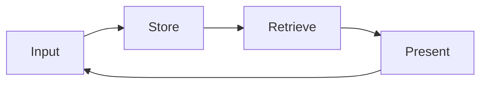

# Memory as Vault, A First-Principles Introduction

The previous category established the academic access infrastructure. This category begins with the question of where every retrieved document should go. A literature scan, an interview transcript, a clinical observation note. All of these must be written somewhere, but into what structure. This booklet offers, as the answer to that question, the Memory as Vault pattern. This pattern is the author's original contribution. It is not a tool recommendation but a tool-independent engineering pattern. The aim is to establish, from first principles, how a scholar holds years of accumulated context in a single persistent system.

## 1. Why a Vault

Two social science examples make the problem concrete. The first is a clinical psychologist who has practiced for ten years. This psychologist holds ten years of session notes, case formulations, supervision records, and summaries of the hundreds of articles they have read. This accumulation is the foundation of clinical wisdom, but when scattered it is inaccessible. The second is a researcher who has conducted twelve years of fieldwork in Komotini and the surrounding villages. This researcher holds field notes, observation journals, photographs, and interview transcripts. This accumulation is twelve years of labor itself, but when unstructured every new project starts from zero.

In both examples the problem is the same. Context accumulates, but context is not accessible. A notebook is a diary, it is chronological, it requires digging into the past. A vault, by contrast, is an archive, it is structural, it rests on navigation rather than recollection. The Memory as Vault pattern is the design that moves an artificial intelligence assisted working environment from a daily notebook to a persistent research vault. To find a piece of information in a diary you must remember when you wrote it. To find a piece of information in a vault it is enough to know where it belongs. This difference, at the scale of ten years, is the difference that determines a researcher's productivity.

## 2. The Historical Chain, From Memex to Zettelkasten

Memory as Vault is not a new consumer trend but part of a seventy-year intellectual tradition. Knowing this tradition is necessary to understand the seriousness and durability of the pattern.

The first link in the chain is Vannevar Bush. Bush (1945), in the essay As We May Think published in The Atlantic, imagined a device he called the Memex. The Memex was a mechanized extension of memory that stored all of an individual's books, records, and communications and built associative trails among them. Bush's insight was that the human mind works by association, and that an information system should therefore allow associative links. The second link is Ted Nelson. Nelson (1965), in his article proposing a file structure for complex, changing, and indeterminate information, defined the concept of hypertext for the first time. Nelson's contribution was the idea that texts can be linked to one another not linearly but as a network.

The third link is Niklas Luhmann. Luhmann (1992) worked with a slip-box system called the Zettelkasten. This system was a paper database in which each slip carried an atomic thought, and the slips were linked to one another by numbers. With this system Luhmann produced, across more than fifty years of productivity, some seventy books and hundreds of articles. The modern application of the Zettelkasten was popularized by Sönke Ahrens (2017). Ahrens reformulated the technique of smart note-taking through atomic notes, links, and the note system as a thinking tool. This chain, from Bush to Ahrens, constitutes the intellectual origin of the Memory as Vault pattern. The pattern is the continuation of this tradition in the age of artificial intelligence.

## 3. Five Principles

Memory as Vault is built on five principles. These principles are the components of the pattern, and each represents an engineering decision.

The first principle is the Markdown base. Every document in the vault is held in plain text Markdown. Plain text is tied to no proprietary software, it can be read thirty years from now, it can be opened with any tool. The second principle is frontmatter. At the head of each document there is structured metadata. Date, type, tags, related documents. This metadata makes the document queryable by machine. The third principle is the file tree. Documents are held in a meaningful folder hierarchy. This hierarchy is not arbitrary but an engineering decision, which is the subject of the next booklet. The fourth principle is links. Documents reference one another through bracketed links, so that Nelson's idea of hypertext comes alive in the vault. The fifth principle is maps of content, that is, MOCs. A map of content is a gateway to a topic, gathering related documents in a single place.

The important feature of these five principles is that all of them are replaceable. Another plain text format can be chosen instead of Markdown, another schema instead of a frontmatter schema, another architecture instead of a folder architecture. What is invariant is not the principles themselves but the logic beneath them. That logic is the subject of the next section.

## 4. The Memory as Vault Engineering Pattern

The core logic of Memory as Vault is a four-step cycle. These four steps, Input, Store, Retrieve, Present, are the invariant skeleton of the pattern. The five principles are one concrete application of this skeleton, but the skeleton itself is independent of both tool and application.

Input is the step where information enters the vault. An article record, a field note, a clinical observation. At this step information is captured and converted to plain text. Store is the step where it is determined where the information belongs. The right folder, the right frontmatter, the right links. This step determines future accessibility, because information stored wrongly cannot be found. Retrieve is the step where information is recalled. A search, a frontmatter query, a link traversal. This step actually reveals the value of the vault. Present is the step where the retrieved information is presented in a new context. A literature synthesis, an argument draft, a case formulation.

The critical feature of the cycle is the feedback from the Present step to Input. The information presented most often produces new information. A synthesis gives rise to a new question. That question returns to the vault as a new input. This feedback keeps the vault alive. A vault is not merely a system that accumulates but one that is continually reorganized, one that reflects on itself. This feature transforms the vault from a storage space into a thinking tool.

What distinguishes this pattern from a database cycle lies in the feedback loop. A database receives, stores, queries, and returns data, but the data it returns does not change the system itself. Memory as Vault, by contrast, reshapes itself at every Present step. When a researcher produces a synthesis, that synthesis enters the vault as a new atomic note, forms new links with older notes, and updates the relevant maps of content. The vault thus becomes a record, over time, of a researcher's way of thinking. This feature raises the four steps from a storage protocol to a research instrument. For the social scientist the consequence is clear. Over ten years the vault does not merely grow, it matures.

## 5. Integration with Claude Code

The power of the Memory as Vault pattern in the age of artificial intelligence comes from a language model's ability to work directly with the vault. Claude Code reaches the contents of the vault through file read permission. This access lets the model ground its answers in the real context within the vault. When the model answers a question, it reads the relevant documents in the vault and uses their content, so that the answer is not a piece of general knowledge but a synthesis grounded in the user's own accumulation.

The technical basis of this mechanism is retrieval-augmented generation. Lewis and colleagues (2020) defined the method of retrieval-augmented generation for knowledge-intensive natural language processing tasks. In this method the model, before producing an answer, pulls relevant passages from a knowledge base and grounds its answer in those passages. Memory as Vault is a concrete application of this method for the social scientist. The vault is the knowledge base of retrieval-augmented generation.

There is an important limit here. The role of the vault is retrieval, not planning. The model pulls information from the vault and presents it, but the vault itself is not a decision-making or planning system. Valmeekam and colleagues (2023), examining critically the planning abilities of large language models, showed that these models have marked limits in complex multi-step planning. This finding explains why the vault should remain in the retrieval role. The vault should be a reliable source of information, but planning and decision should remain with the researcher. Khattab and colleagues (2023), with the DSPy framework that compiles declarative language model calls into self-improving pipelines, showed how the retrieval and language model components can be structured. This framework is one example of how the retrieval component of Memory as Vault can be technically reinforced.

## 6. Retrieval Patterns

There are several patterns for retrieving information from a vault, and they line up in an order of increasing subtlety. The most basic pattern is text search. A term or phrase is searched across all documents of the vault. This is done with the classic tool called grep, and it is the fastest way to find where a keyword occurs. The second pattern is file pattern matching, that is, glob. Files matching a particular name or location are gathered, for example all daily files belonging to a particular year.

The third pattern is the frontmatter query. The structured metadata of documents is queried, for example all documents tagged with a particular topic and written after a particular date. This query reveals the structural power of the vault, because it makes a structural selection rather than a chronological dig. The fourth and most advanced pattern is semantic search. This is done with a semantic search tool connected through MCP. Semantic search finds not the exact match of a term but documents that are close in meaning. When a researcher searches for anxiety, documents related in meaning such as worry, fear, and unease also arrive. These four patterns offer a spectrum extending from the simple keyword to deep semantic matching, and the researcher selects the most appropriate pattern for each query.

## 7. Risks

Memory as Vault is a powerful pattern, but it is not without risk. Three risks require attention. The first is conceptual fatigue. Continually organizing, tagging, and linking a vault takes labor. If this labor exceeds the value of the vault, the vault becomes a burden. The mitigation is to keep the structure of the vault simple. The five principles should be applied with the least possible friction. A vault does not have to be perfectly organized, it is enough that it be sufficiently accessible.

The second risk is tool dependence. If a researcher ties their vault to a particular piece of software, for example a single note application, the vault is put at risk when that software changes or shuts down. The mitigation is the plain text Markdown principle. As long as the vault is plain text, it is tied to no single tool and can be opened with any editor. The third and most serious risk is clinical data. The vault of a clinical psychologist should not contain non-anonymized patient data. This is both an ethical and a legal obligation. Clinical data may enter the vault only de-identified and within the framework of ethics board approval. This risk requires the regional legal framework that is the subject of the next section.

## 8. Turkey and Greece Specificity

When clinical and human subject data are at stake, Turkey and Greece offer two distinct but overlapping legal frameworks. In Turkey, Law No. 6698 on the Protection of Personal Data sets clinical data apart as special category personal data. The Personal Data Protection Authority (2024), in its guide on the protection of personal health data, emphasizes the quality of explicit consent and the principle of data minimization. The practical consequence is the following. In Turkey a clinical psychologist or hospital researcher does not, and should not, hold non-anonymized clinical data in their vault.

Because Greece is a member of the European Union, the General Data Protection Regulation, that is, the GDPR, applies directly. The European Data Protection Board (2024), in its guidelines on the protection of personal data in research, defines the limits of data processing in the research context. The structural similarity between the Turkish law and the GDPR is high, both share the principles of data minimization and purpose limitation. The practice of the ethics board at Democritus University in Komotini is one concrete application of this framework. A field researcher, when bringing interview transcripts into the vault, replaces participant identities with codes, so that the vault remains both functional for research and legally compliant.

## 9. Bridge, to Vault Architecture

Of the four steps of Memory as Vault, the Store step is the subject of the next booklet. The question of where information belongs looks simple, but it is an engineering decision. A wrong folder architecture turns, over the years, into a hidden productivity tax. A right architecture moves finding a file from conceptual recollection to structural navigation. The next booklet treats folder discipline and the maps of content pattern not as a personal preference but as an engineering decision.

## References

Ahrens, S. (2017). *How to take smart notes: One simple technique to boost writing, learning and thinking*. ISBN 978-1542866507

Bush, V. (1945, July). As we may think. *The Atlantic Monthly*, 176(1), 101-108.

Engel, G. L. (1977). The need for a new medical model: A challenge for biomedicine. *Science*, 196(4286), 129-136. https://doi.org/10.1126/science.847460

European Data Protection Board. (2024). *Guidelines on the protection of personal data in research*. https://edpb.europa.eu

Khattab, O., Singhvi, A., Maheshwari, P., Zhang, Z., Santhanam, K., Vardhamanan, S., Haq, S., Sharma, A., Joshi, T. T., Moazam, H., Miller, H., Zaharia, M., & Potts, C. (2023). DSPy: Compiling declarative language model calls into self-improving pipelines. *arXiv*. https://arxiv.org/abs/2310.03714

Lewis, P., Perez, E., Piktus, A., Petroni, F., Karpukhin, V., Goyal, N., Küttler, H., Lewis, M., Yih, W., Rocktäschel, T., Riedel, S., & Kiela, D. (2020). Retrieval-augmented generation for knowledge-intensive NLP tasks. *Advances in Neural Information Processing Systems*, 33, 9459-9474. https://arxiv.org/abs/2005.11401

Nelson, T. H. (1965). Complex information processing: A file structure for the complex, the changing and the indeterminate. *Proceedings of the 1965 20th National Conference*, 84-100. https://doi.org/10.1145/800197.806036

Personal Data Protection Authority. (2024). *Guide on the protection of personal health data*. https://www.kvkk.gov.tr

Valmeekam, K., Marquez, M., Sreedharan, S., & Kambhampati, S. (2023). On the planning abilities of large language models: A critical investigation. *Advances in Neural Information Processing Systems (NeurIPS 2023)*. https://arxiv.org/abs/2305.15771

---

**Booklet ID.** `003-01-0001`
**Version.** `0.1.0`
**Date.** 2026-05-24
**Word count (approx.).** 2267 (English body text, measured with wc)
**Verified citations.** 10
**Hallucinated citations.** 0
**Original concept.** Memory as Vault is the author's original engineering concept.
**Previous booklet.** [`002-04-0001`](../../002-academic-access/002-04-0001/en.md). DergiPark, ULAKBIM TR Dizin, HEAL-Link, and Regional Indexing
**Next booklet.** [`004-01-0001`](../../004-vault-architecture/004-01-0001/en.md). Folder Discipline and the Maps of Content (MOC) Pattern
