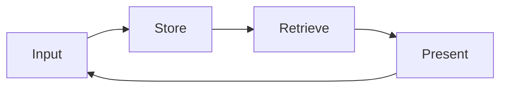

# Kasa Olarak Hafıza, İlkesel Bir Giriş

Önceki kategori, akademik erişim altyapısını kurmuştu. Bu kategori, erişilen her belgenin nereye gideceği sorusuyla başlar. Bir literatür taraması, bir mülakat transkripti, bir klinik gözlem notu. Bunların hepsi bir yere yazılmalıdır, ama hangi yapıya. Bu broşür, bu sorunun yanıtı olarak Kasa Olarak Hafıza kalıbını sunar. Bu kalıp, yazarın özgün katkısıdır. Bir araç tavsiyesi değil, araçtan bağımsız bir mühendislik kalıbıdır. Hedef, bir akademisyenin yıllarca biriken bağlamını tek bir kalıcı sistemde nasıl tutacağını ilkesel temelinden kurmaktır.

## 1. Niçin Bir Kasa

İki sosyal bilim örneği, sorunu somutlaştırır. Birincisi, on yıldır pratik yapan bir klinik psikologdur. Bu psikoloğun elinde, on yıllık seans notları, vaka formülasyonları, süpervizyon kayıtları, okuduğu yüzlerce makalenin özetleri vardır. Bu birikim, klinik bilgeliğin temelidir, ama dağınık olduğunda erişilemez. İkincisi, Komotini ve çevresindeki köylerde on iki yıllık bir saha çalışması yürüten bir araştırmacıdır. Bu araştırmacının elinde, alan notları, gözlem günlükleri, fotoğraflar, görüşme dökümleri vardır. Bu birikim, on iki yıllık emeğin kendisidir, ama yapısız olduğunda her yeni proje sıfırdan başlar.

Her iki örnekte de sorun aynıdır. Bağlam birikiyor ama bağlam erişilebilir değil. Bir not defteri, bir günlüktür, kronolojiktir, geçmişe doğru kazı yapmak gerektirir. Bir kasa ise bir arşivdir, yapısaldır, hatırlamaya değil navigasyona dayanır. Kasa olarak hafıza kalıbı, yapay zeka destekli bir çalışma ortamını bir günlük not defterinden bir kalıcı araştırma kasasına geçiren tasarımdır. Bir günlük defterinde bir bilgiyi bulmak için onu ne zaman yazdığınızı hatırlamanız gerekir. Bir kasada bir bilgiyi bulmak için onun nereye ait olduğunu bilmeniz yeter. Bu fark, on yıl ölçeğinde, bir araştırmacının üretkenliğini belirleyen farktır.

## 2. Tarihsel Zincir, Memex'ten Zettelkasten'a

Kasa olarak hafıza yeni bir tüketim trendi değil, yetmiş yıllık bir entelektüel geleneğin parçasıdır. Bu geleneği bilmek, kalıbın ciddiyetini ve dayanıklılığını anlamak için gereklidir.

Zincirin ilk halkası Vannevar Bush'tur. Bush (1945), The Atlantic'te yayımlanan As We May Think başlıklı denemesinde, Memex adını verdiği bir aygıt tasavvur etti. Memex, bir bireyin tüm kitaplarını, kayıtlarını ve iletişimini saklayan, bunlar arasında çağrışımsal izler kuran mekanize bir hafıza uzantısıydı. Bush'un öngörüsü, insan zihninin çağrışımla çalıştığı, dolayısıyla bilgi sisteminin de çağrışımsal bağlantılara izin vermesi gerektiğiydi. İkinci halka Ted Nelson'dur. Nelson (1965), karmaşık, değişen ve belirsiz bilgi için bir dosya yapısı önerdiği makalesinde, hipertekst kavramını ilk kez tanımladı. Nelson'un katkısı, metinlerin doğrusal değil ağsal olarak birbirine bağlanabileceği fikriydi.

Üçüncü halka Niklas Luhmann'dır. Luhmann (1992), Zettelkasten denen fiş kutusu sistemiyle çalıştı. Bu sistem, her fişin bir atomik düşünce taşıdığı, fişlerin birbirine numaralarla bağlandığı bir kağıt veri tabanıydı. Luhmann bu sistemle elli yılı aşkın bir verimlilikle, yetmiş kitap ve yüzlerce makale üretti. Zettelkasten'in modern uygulamasını Sönke Ahrens (2017) popülerleştirdi. Ahrens, akıllı not alma tekniğini, atomik notlar, bağlantılar ve bir düşünme aracı olarak not sistemi üzerinden yeniden formüle etti. Bu zincir, Bush'tan Ahrens'e, kasa olarak hafıza kalıbının entelektüel kökenini oluşturur. Kalıp, bu geleneğin yapay zeka çağındaki devamıdır.

## 3. Beş İlke

Kasa olarak hafıza, beş ilke üzerine kurulur. Bu ilkeler, kalıbın bileşenleridir ve her biri bir mühendislik kararını temsil eder.

Birinci ilke, Markdown tabandır. Kasanın her belgesi düz metin Markdown biçiminde tutulur. Düz metin, hiçbir tescilli yazılıma bağlı değildir, otuz yıl sonra da okunabilir, her araçla açılabilir. İkinci ilke, frontmatter'dır. Her belgenin başında, yapılandırılmış üst veri bulunur. Tarih, tür, etiketler, ilişkili belgeler. Bu üst veri, belgenin makine tarafından sorgulanabilir olmasını sağlar. Üçüncü ilke, dosya ağacıdır. Belgeler, anlamlı bir klasör hiyerarşisinde tutulur. Bu hiyerarşi rastgele değil, bir mühendislik kararıdır, sonraki broşürün konusu budur. Dördüncü ilke, bağlantılardır. Belgeler birbirine köşeli parantez bağlantılarıyla referans verir, böylece Nelson'un hipertekst fikri kasada canlanır. Beşinci ilke, içerik haritalarıdır, yani MOC. Bir içerik haritası, bir konuya giriş kapısıdır, ilgili belgeleri tek bir yerde toplar.

Bu beş ilkenin önemli özelliği, hepsinin değiştirilebilir olmasıdır. Markdown yerine başka bir düz metin biçimi, bir frontmatter şeması yerine başka bir şema, bir klasör mimarisi yerine başka bir mimari seçilebilir. Değişmez olan ilkelerin kendisi değil, bunların altında yatan mantıktır. O mantık, bir sonraki bölümün konusudur.

## 4. Memory-as-Vault Mühendislik Kalıbı

Kasa olarak hafızanın çekirdek mantığı, dört adımlı bir döngüdür. Bu dört adım, Input, Store, Retrieve, Present, kalıbın değişmez iskeletidir. Beş ilke bu iskeletin somut bir uygulamasıdır, ama iskeletin kendisi araçtan da uygulamadan da bağımsızdır.

Input, bilginin kasaya girdiği adımdır. Bir makale künyesi, bir alan notu, bir klinik gözlem. Bu adımda bilgi yakalanır ve düz metne dönüştürülür. Store, bilginin nereye ait olduğunun belirlendiği adımdır. Doğru klasör, doğru frontmatter, doğru bağlantılar. Bu adım, gelecekteki erişilebilirliği belirler, çünkü yanlış saklanan bir bilgi bulunamaz. Retrieve, bilginin geri çağrıldığı adımdır. Bir arama, bir frontmatter sorgusu, bir bağlantı takibi. Bu adım, kasanın değerini fiilen ortaya çıkarır. Present, geri çağrılan bilginin yeni bir bağlamda sunulduğu adımdır. Bir literatür sentezi, bir argüman taslağı, bir vaka formülasyonu.

Döngünün kritik özelliği, Present adımından Input'a geri beslemedir. Sunulan bilgi, çoğu zaman yeni bilgi üretir. Bir sentez, yeni bir soru doğurur. O soru, kasaya yeni bir girdi olarak döner. Bu geri besleme, kasayı canlı tutar. Bir kasa, yalnızca biriktiren değil, sürekli yeniden düzenlenen, kendi üzerine düşünen bir sistemdir. Bu özellik, kasayı bir depolama alanından bir düşünme aracına dönüştürür.

Bu kalıbın bir veri tabanı döngüsünden farkı, geri besleme halkasında yatar. Bir veri tabanı veriyi alır, saklar, sorgular ve döndürür, ama döndürdüğü veri sistemin kendisini değiştirmez. Kasa olarak hafıza ise her Present adımında kendini yeniden şekillendirir. Bir araştırmacı bir sentez ürettiğinde, o sentez kasaya yeni bir atomik not olarak girer, eski notlarla yeni bağlantılar kurar ve ilgili içerik haritalarını günceller. Böylece kasa, bir araştırmacının düşünme tarzının zaman içindeki bir kaydına dönüşür. Bu özellik, dört adımı bir depolama protokolünden bir araştırma enstrümanına yükseltir. Sosyal bilimci için sonuç açıktır. Kasa on yıl boyunca yalnızca büyümez, olgunlaşır.

## 5. Claude Code ile Entegrasyon

Kasa olarak hafıza kalıbının yapay zeka çağındaki gücü, bir dil modelinin kasayla doğrudan çalışabilmesinden gelir. Claude Code, dosya okuma yetkisiyle kasanın içeriğine erişir. Bu erişim, modelin yanıtlarını kasadaki gerçek bağlama dayandırmasını sağlar. Model, bir soruya yanıt verirken, kasadaki ilgili belgeleri okur, onların içeriğini kullanır, böylece yanıt genel bir bilgi değil, kullanıcının kendi birikimine dayalı bir sentez olur.

Bu mekanizmanın teknik temeli, geri çağırma destekli üretimdir. Lewis ve diğerleri (2020), bilgi yoğun doğal dil işleme görevleri için geri çağırma destekli üretim yöntemini tanımladı. Bu yöntemde model, yanıt üretmeden önce bir bilgi tabanından ilgili parçaları çeker ve yanıtını bu parçalara dayandırır. Kasa olarak hafıza, bu yöntemin sosyal bilimci için somut bir uygulamasıdır. Kasa, geri çağırma destekli üretimin bilgi tabanıdır.

Burada önemli bir sınır vardır. Kasanın rolü, retrieval'dır, planning değil. Model, kasadan bilgi çeker ve sunar, ama kasanın kendisi bir karar verme ya da planlama sistemi değildir. Valmeekam ve diğerleri (2023), büyük dil modellerinin planlama yeteneklerini eleştirel olarak inceleyerek, bu modellerin karmaşık çok adımlı planlamada belirgin sınırları olduğunu gösterdi. Bu bulgu, kasanın niçin retrieval rolünde kalması gerektiğini açıklar. Kasa güvenilir bir bilgi kaynağı olmalı, ama planlama ve karar araştırmacının kendisinde kalmalıdır. Khattab ve diğerleri (2023), bildirimsel dil modeli çağrılarını kendini iyileştiren işlem hatlarına derleyen DSPy çerçevesiyle, retrieval ve dil modeli bileşenlerinin nasıl yapılandırılabileceğini gösterdi. Bu çerçeve, kasa olarak hafızanın retrieval bileşeninin teknik olarak nasıl sağlamlaştırılabileceğine bir örnektir.

## 6. Geri Çağırma Kalıpları

Bir kasadan bilgi geri çağırmanın birkaç kalıbı vardır ve bunlar giderek artan bir incelik sırasında dizilir. En temel kalıp, metin aramasıdır. Bir terim ya da ifade, kasanın tüm belgelerinde aranır. Bu, grep adı verilen klasik araçla yapılır ve bir anahtar kelimenin nerede geçtiğini bulmanın en hızlı yoludur. İkinci kalıp, dosya örüntüsü eşlemesidir, yani glob. Belirli bir ada ya da konuma uyan dosyalar toplanır, örneğin belirli bir yıla ait tüm günlük dosyaları.

Üçüncü kalıp, frontmatter sorgusudur. Belgelerin yapılandırılmış üst verisi sorgulanır, örneğin etiketi belirli bir konu olan ve belirli bir tarihten sonra yazılmış tüm belgeler. Bu sorgu, kasanın yapısal gücünü ortaya çıkarır, çünkü kronolojik kazı yerine yapısal seçim yapar. Dördüncü ve en gelişmiş kalıp, anlamsal aramadır. Bu, MCP üzerinden bağlanan bir anlamsal arama aracıyla yapılır. Anlamsal arama, bir terimin tam eşleşmesini değil, anlamca yakın belgeleri bulur. Bir araştırmacı kaygı ararken, endişe, korku, anksiyete gibi anlamca ilişkili belgeler de gelir. Bu dört kalıp, basit anahtar kelimeden derin anlamsal eşleşmeye uzanan bir yelpaze sunar, ve araştırmacı her sorgu için en uygun kalıbı seçer.

## 7. Riskler

Kasa olarak hafıza güçlü bir kalıptır, ama risksiz değildir. Üç risk dikkat gerektirir. Birincisi, kavramsal yorgunluktur. Bir kasayı sürekli düzenlemek, etiketlemek, bağlantılamak emek ister. Bu emek, kasanın değerini aşarsa, kasa bir yük olur. Azaltma, kasanın yapısını basit tutmaktır. Beş ilke, mümkün olan en az sürtünmeyle uygulanmalıdır. Bir kasa, mükemmel düzenli olmak zorunda değildir, yeterince erişilebilir olması yeter.

İkinci risk, araç bağımlılığıdır. Bir araştırmacı kasasını belirli bir yazılıma, örneğin tek bir not uygulamasına bağlarsa, o yazılım değiştiğinde ya da kapandığında kasa risk altına girer. Azaltma, düz metin Markdown ilkesidir. Kasa düz metin olduğu sürece, hiçbir tek araca bağlı değildir, herhangi bir editörle açılabilir. Üçüncü ve en ciddi risk, klinik veridir. Bir klinik psikoloğun kasasında anonimleştirilmemiş hasta verisi bulunmamalıdır. Bu hem etik hem hukuki bir zorunluluktur. Klinik veri, ancak kimliksizleştirilmiş ve etik kurul onayı çerçevesinde kasaya girebilir. Bu risk, bir sonraki bölümün konusu olan bölgesel hukuk çerçevesini gerektirir.

## 8. Türkiye ve Yunanistan Özgüllüğü

Klinik ve insan denek verisi söz konusu olduğunda, Türkiye ve Yunanistan iki farklı ama örtüşen hukuki çerçeve sunar. Türkiye'de 6698 sayılı Kişisel Verilerin Korunması Kanunu, klinik veriyi özel nitelikli kişisel veri olarak ayırır. Kişisel Verileri Koruma Kurumu (2024), kişisel sağlık verilerinin korunmasına ilişkin rehberinde, açık rızanın kalitesi ve veri minimizasyonu ilkesini vurgular. Pratik sonuç şudur. Türkiye'de bir klinik psikolog ya da hastane araştırmacısı, kasasında anonimleştirilmemiş klinik veri tutmaz ve tutmamalıdır.

Yunanistan, Avrupa Birliği üyesi olduğu için, Genel Veri Koruma Tüzüğü, yani GDPR doğrudan uygulanır. Avrupa Veri Koruma Kurulu (2024), araştırmada kişisel verilerin korunmasına ilişkin kılavuzunda, araştırma bağlamında veri işlemenin sınırlarını tanımlar. KVKK ile GDPR arasındaki yapısal benzerlik yüksektir, her ikisi de veri minimizasyonu ve amaç sınırlaması ilkelerini paylaşır. Komotini'deki Demokritus Üniversitesi etik kurulunun pratiği, bu çerçevenin somut bir uygulamasıdır. Bir saha araştırmacısı, görüşme dökümlerini kasaya alırken, katılımcı kimliklerini kodlarla değiştirir, böylece kasa hem araştırma için işlevsel hem de hukuki olarak uyumlu kalır.

## 9. Köprü, Kasa Mimarisine

Kasa olarak hafızanın dört adımından Store adımı, bir sonraki broşürün konusudur. Bilginin nereye ait olduğu sorusu, basit görünür ama bir mühendislik kararıdır. Yanlış bir klasör mimarisi, yıllar içinde gizli bir verimlilik vergisine dönüşür. Doğru bir mimari, dosya bulmayı kavramsal hatırlamadan yapısal navigasyona taşır. Bir sonraki broşür, klasör disiplinini ve içerik haritası kalıbını bir kişisel tercih değil bir mühendislik kararı olarak ele alır.

## Kaynakça

Ahrens, S. (2017). *How to take smart notes: One simple technique to boost writing, learning and thinking*. ISBN 978-1542866507

Avrupa Veri Koruma Kurulu. (2024). *Guidelines on the protection of personal data in research*. https://edpb.europa.eu

Bush, V. (1945, Temmuz). As we may think. *The Atlantic Monthly*, 176(1), 101-108.

Engel, G. L. (1977). The need for a new medical model: A challenge for biomedicine. *Science*, 196(4286), 129-136. https://doi.org/10.1126/science.847460

Khattab, O., Singhvi, A., Maheshwari, P., Zhang, Z., Santhanam, K., Vardhamanan, S., Haq, S., Sharma, A., Joshi, T. T., Moazam, H., Miller, H., Zaharia, M., & Potts, C. (2023). DSPy: Compiling declarative language model calls into self-improving pipelines. *arXiv*. https://arxiv.org/abs/2310.03714

Kişisel Verileri Koruma Kurumu. (2024). *Kişisel sağlık verilerinin korunmasına ilişkin rehber*. https://www.kvkk.gov.tr

Lewis, P., Perez, E., Piktus, A., Petroni, F., Karpukhin, V., Goyal, N., Küttler, H., Lewis, M., Yih, W., Rocktäschel, T., Riedel, S., & Kiela, D. (2020). Retrieval-augmented generation for knowledge-intensive NLP tasks. *Advances in Neural Information Processing Systems*, 33, 9459-9474. https://arxiv.org/abs/2005.11401

Luhmann, N. (1992). Kommunikation mit Zettelkästen. In *Universität als Milieu: Kleine Schriften* (s. 53-61). Haux.

Nelson, T. H. (1965). Complex information processing: A file structure for the complex, the changing and the indeterminate. *Proceedings of the 1965 20th National Conference*, 84-100. https://doi.org/10.1145/800197.806036

Valmeekam, K., Marquez, M., Sreedharan, S., & Kambhampati, S. (2023). On the planning abilities of large language models: A critical investigation. *Advances in Neural Information Processing Systems (NeurIPS 2023)*. https://arxiv.org/abs/2305.15771

---

**Broşür kimliği.** `003-01-0001`
**Sürüm.** `0.1.0`
**Tarih.** 2026-05-24
**Sözcük sayısı (yaklaşık).** 1700 (Türkçe gövde metni, wc ile ölçüldü)
**Doğrulanmış atıf sayısı.** 10
**Halüsinasyon atıf sayısı.** 0
**Özgün kavram.** Kasa Olarak Hafıza, yazarın özgün mühendislik kavramıdır.
**Önceki broşür.** [`002-04-0001`](../../002-academic-access/002-04-0001/tr.md). DergiPark, ULAKBIM TR Dizin, HEAL-Link ve Bölgesel İndeksleme
**Sonraki broşür.** [`004-01-0001`](../../004-vault-architecture/004-01-0001/tr.md). Klasör Disiplini ve Maps of Content (MOC) Kalıbı
