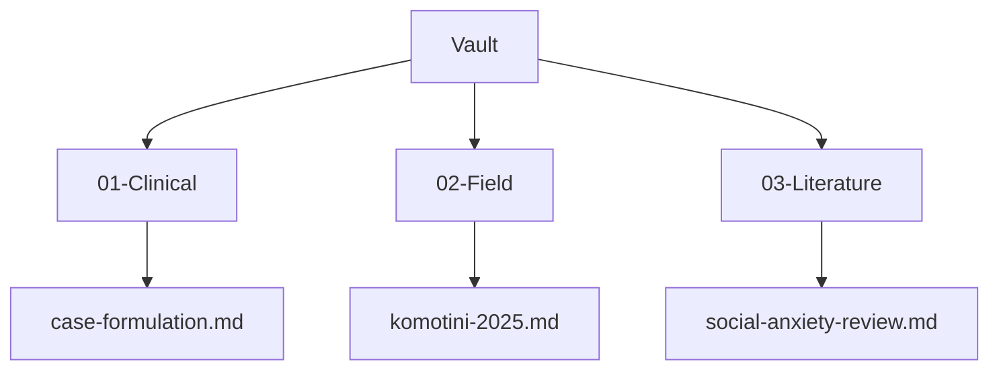
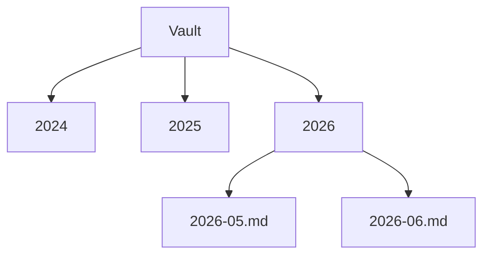
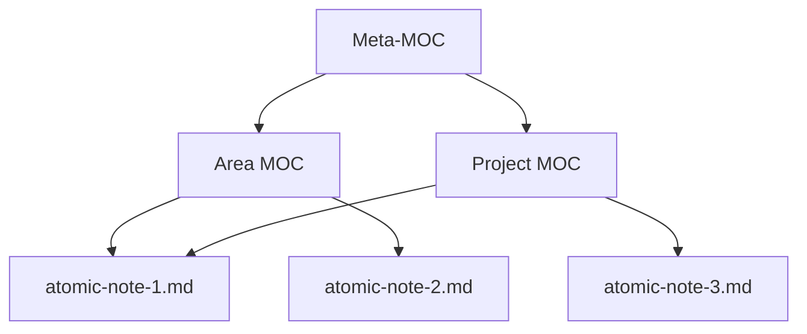

# Folder Discipline and the Maps of Content (MOC) Pattern

The previous booklet established the four steps of the Memory as Vault pattern. This booklet deepens the Store step among those four. The question of where information belongs looks simple on the surface, but it is an engineering decision. A wrong folder architecture imposes, within months, a hidden productivity tax on a researcher. A right architecture moves finding a file from conceptual recollection to structural navigation. The aim is to treat a folder architecture not as a personal taste but as a design decision, and to adapt the maps of content pattern to the social science context.

## 1. The Cost Calculation of Folder Choice

When a scholar sets up their vault, they most often choose the folder architecture without thinking. The first structure that comes to mind is built, files are dropped in, and work begins. This choice looks cheap, but its real cost emerges over time. Six months later, when a researcher searches for a file, they have to remember where they left it. A year later, the same document sits in two different folders under two different names. Two years later, half of the vault becomes inaccessible, because which information is where is no longer clear.

This cost is a hidden tax, because it is not directly visible. Every misplaced file produces a future search cost. The basic principle Norman (2013) set out on the design of everyday things applies directly here. The usability of a system is inversely proportional to how much the user has to think while using it. A well-designed vault does not require the researcher to think in order to find a file, because the structure itself shows the way. This booklet offers the principles for building that structure. Folder discipline is not an aesthetic preference but an engineering investment that lowers, from today, the future cost of access.

## 2. A Comparison of Three Common Architectures

Three basic folder architectures are common in academic vaults. Each has a logic and a cost.

The first is the topical architecture. Folders are organized by research area. Clinical notes in one folder, fieldwork in another, literature in a third.



The second is the chronological architecture. Folders are organized by time. One folder per year, one subfolder per month. This architecture is natural for journaling, but it hides the topical context of a piece of information.



The third is the project-based architecture. Folders are organized by active projects. This architecture is efficient in the short term, but it conflicts with the long-lived nature of academic production, because a project ends while the knowledge it produced remains. None of these three architectures is sufficient on its own. The topical architecture hides time, the chronological architecture hides topic, the project-based architecture hides permanence. The solution is not to choose one of them but to add a navigation layer. That layer is the map of content.

## 3. PARA, Zettelkasten, and Johnny Decimal

Three popular organization patterns shed light on academic vault design, but none is sufficient as it stands.

The PARA pattern is a system proposed by Tiago Forte (2022). Projects, Areas, Resources, Archive. This pattern organizes information by its proximity to action. PARA is powerful for personal productivity, but it is insufficient as it stands for academic production. The problem is the following. In an academic vault an article begins as a Project, then becomes a Resource, then ten years later becomes an Archive. PARA captures this life cycle, but across that cycle the file must be moved, which creates friction. The Zettelkasten pattern is the atomic note system popularized by Sönke Ahrens (2017). This pattern builds a network in which each note carries a single thought and the notes are linked to one another. The Zettelkasten is powerful for developing ideas, but it is insufficient on its own for managing large document collections.

The Johnny Decimal pattern organizes folders with a numbered decimal system. An area is 10-19, a subarea is 11, a document is 11.01. This pattern makes navigation numerical and precise. For an academic vault, the value of Johnny Decimal is that it brings an ordering and an addressing system embedded in folder names. The suitability map of these three patterns for the social sciences is the following. PARA strengthens the life cycle, the Zettelkasten the connection of ideas, Johnny Decimal navigation. The most robust academic vault combines the strengths of all three. Numbered folders, atomic notes, and the maps of content that link them to one another. The basic principle Allen (2015) set out with his getting things done method also contributes here. A system reduces mental load only when it is trustworthy. A scholar's ability to trust the vault depends on the consistency of the structure.

## 4. MOC, the Maps of Content Pattern

The map of content, that is, the MOC, is the navigation spine of a vault. A map of content is a gateway opening onto a topic. It gathers related documents in a single place, provides brief context among them, and directs the reader to the right document. A map of content is not a folder but a document. Folders group files physically, maps of content group files conceptually. This distinction is critical, because a file sits in a single folder but can appear in multiple maps of content.

Why a map of content is necessary follows from the limit of the three architectures in the second section. Folder architecture is one-dimensional, a file is in one folder. But knowledge is multidimensional, a case note can belong to the clinical area, to a particular project, and to a particular theory all at once. The map of content captures this multidimensionality. Bates's (2002) integrated model of information seeking and searching supports this point. Researchers search for information not by a single linear path but from many interconnected entry points. The map of content makes these entry points concrete.

How a map of content is built is simple. A topic is chosen, the documents related to that topic are listed, a short context sentence is added to each document, and the map is framed with an introductory paragraph. The principles Tufte (1990) set out on visualizing information apply here. A good map should be free of unnecessary ornament, high in information density, and readable to the eye. A map of content is the visible structure of a vault.

## 5. The Atomic Note, MOC, Meta-MOC Hierarchy

Maps of content do not remain at a single level, they form a hierarchy. This hierarchy is three-layered.



The lowest layer is the atomic note. An atomic note carries a single thought, a single source, or a single observation. Atomic notes are the building blocks of the vault. The middle layer is the map of content. A map of content gathers related atomic notes under a topic. The top layer is the meta map of content, that is, the meta-MOC. A meta-MOC gathers maps of content, it is the highest-level navigation gateway of the vault. When a researcher enters the vault they first open the meta-MOC, from there move to the relevant area map, and from there descend to a particular atomic note.

The power of this hierarchy is that the same atomic note can appear in multiple maps of content. As seen in the diagram, atomic-note-1 appears both in the Area MOC and in the Project MOC. This overcomes the one-dimensionality of folder architecture. The file sits physically in a single folder, but conceptually it lives in multiple maps. The hierarchy transforms the vault from a pile of files into a navigable knowledge space.

## 6. Markdown Conventions

The consistency of a vault rests on small but disciplined conventions. These conventions ensure that the same rules are applied in every document of the vault.

| Element | Convention | Example |
|---|---|---|
| File name | English, lowercase, hyphen-separated | `clinical-case-formulation.md` |
| Title | Turkish, in the frontmatter `title` field | `title: "Vaka Formülasyonu"` |
| Internal link | Double square brackets | `[[komotini-field-2025]]` |
| Tag | frontmatter list | `tags: [clinical, formulation]` |
| Date | ISO 8601 format | `2026-05-24` |
| Heading level | A single first-level heading | `# Document Title` |

The most important of these conventions is the distinction between the file name and the title. The file name is kept English and plain, while the Turkish title lives within the frontmatter. The reason for this distinction is the Unicode issue that is the subject of a later section. Double square bracket links are the concrete application of the hypertext principle described in the previous booklet. When a document references another document, that reference becomes a navigable link. Frontmatter tags let the machine query the vault. A researcher can gather all documents bearing a particular tag with a single command.

## 7. An Example Academic Vault, Three MOC Types

A concrete example clarifies the pattern. Consider the vault of a clinical psychologist with ten years of practice. This vault contains three types of maps of content.

The first is the project map of content. It manages an active research project.

```text
---
type: moc-project
tags: [moc, social-anxiety-study]
---
# Social Anxiety Study MOC

This map gathers all documents of the ongoing social anxiety research.

- [[social-anxiety-literature-review]] literature review summary
- [[komotini-field-2025]] field data notes
- [[analysis-plan-v2]] current analysis plan
```

The second is the area map of content. It tracks a field of expertise over the long term.

```text
---
type: moc-area
tags: [moc, clinical-formulation]
---
# Clinical Formulation Area MOC

All conceptual notes accumulated on case formulation.

- [[biopsychosocial-model]] theoretical framework
- [[formulation-template]] standard template
```

The third is the archive map of content. It preserves completed projects. When a project ends, the project map is linked to the archive map, but the documents are not deleted. These three types together enrich Forte's (2022) PARA life cycle with a map of content layer. A project begins from the project map, matures in the area map, and is preserved in the archive map. The document is never moved, only its visibility in the maps changes. This eliminates PARA's moving friction.

## 8. Resilience to Tool Changes

The long life of a vault rests on its being tied to no single tool. A researcher may hold their vault today in a note application, but that application may shut down five years from now or change its pricing policy. The vault must be resilient to this change. The basis of resilience is the plain text Markdown principle. Maps of content, square bracket links, and frontmatter are all plain text conventions. They are tied not to a particular application but to the Markdown standard.

The practical test is the following. When a vault is taken out of your favorite application and opened in a plain text editor, is it still navigable. In a well-designed vault the answer is yes, because the links are visible within the text, the maps are readable documents, and the tags are plain text fields. When a tool changes, the only thing lost is the visual conveniences that tool offered, not the vault itself. This resilience makes the vault reliable at the scale of ten years.

## 9. Turkey and Greece Specificity

Turkish and Greek file names harbor a technical trap. Turkish characters, in particular ğ, ü, ş, ı, ö, ç, can cause problems between operating systems when used in file names. The reason is that Unicode normalization works differently on different systems. While the macOS file system stores characters in one form, that is, NFD, Linux expects another form, that is, NFC. When a vault is moved between these two systems through git, file names with Turkish characters can become corrupted or duplicated.

The solution is simple and is already established in the previous conventions. File names are kept English and plain, while the Turkish title lives in the `title` field within the frontmatter. For example, a document is stored under the name `social-anxiety-review.md`, but its frontmatter contains `title: "Sosyal Kaygı Derlemesi"`. This rule both solves the technical problem and eases international collaboration, because English file names travel safely across different language environments. The same rule holds for Greek, plain Latin-letter file names are used instead of αβγ characters. This is not a deep technical debate but a single discipline rule, with detailed troubleshooting left to the closing booklet.

## 10. Bridge, to Citation Discipline

After the folder architecture is established, the bibliographic cleanliness of every reference that enters it determines the long life of the vault. However well a vault is organized, if the citations within it are inconsistent, academic production will not be reliable. The next category addresses APA 7 and DOI discipline, showing how every reference is held in a correct, verified, and consistent form. Knuth's (1984) philosophy of literate programming is the foundation of this booklet too. Write your document so that a human can read it, and accept the machine's ability to read it as an additional feature. As Brown and Duguid (2017) showed on the social life of information, a vault is not merely a file store but an environment in which knowledge lives with its context.

## References

Ahrens, S. (2017). *How to take smart notes: One simple technique to boost writing, learning and thinking*. ISBN 978-1542866507

Allen, D. (2015). *Getting things done: The art of stress-free productivity* (revised edition). Penguin Books. ISBN 978-0-14-312656-9

Bates, M. J. (2002). Toward an integrated model of information seeking and searching. *New Review of Information Behaviour Research*, 3(1), 1-15.

Brown, J. S., & Duguid, P. (2017). *The social life of information* (updated edition, with a new preface). Harvard Business Review Press. ISBN 978-1-63369-241-1

Forte, T. (2022). *Building a second brain: A proven method to organize your digital life and unlock your creative potential*. Atria Books. ISBN 978-1-9821-6738-9

Knuth, D. E. (1984). Literate programming. *The Computer Journal*, 27(2), 97-111. https://doi.org/10.1093/comjnl/27.2.97

Norman, D. A. (2013). *The design of everyday things* (revised and expanded edition). Basic Books. ISBN 978-0-465-05065-9

Tufte, E. R. (1990). *Envisioning information*. Graphics Press. ISBN 978-0-9613921-1-6

---

**Booklet ID.** `004-01-0001`
**Version.** `0.1.0`
**Date.** 2026-05-24
**Word count (approx.).** 2260 (English body text, measured with wc)
**Verified citations.** 8
**Hallucinated citations.** 0
**Previous booklet.** [`003-01-0001`](../../003-memory-system/003-01-0001/en.md). Memory as Vault, A First-Principles Introduction
**Next booklet.** [`007-02-0001`](../../007-academic-writing/007-02-0001/en.md). APA 7 with DOI Discipline
