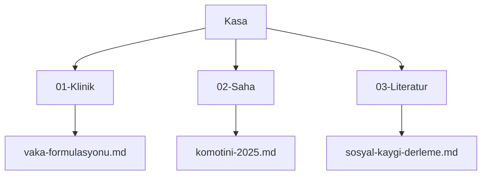
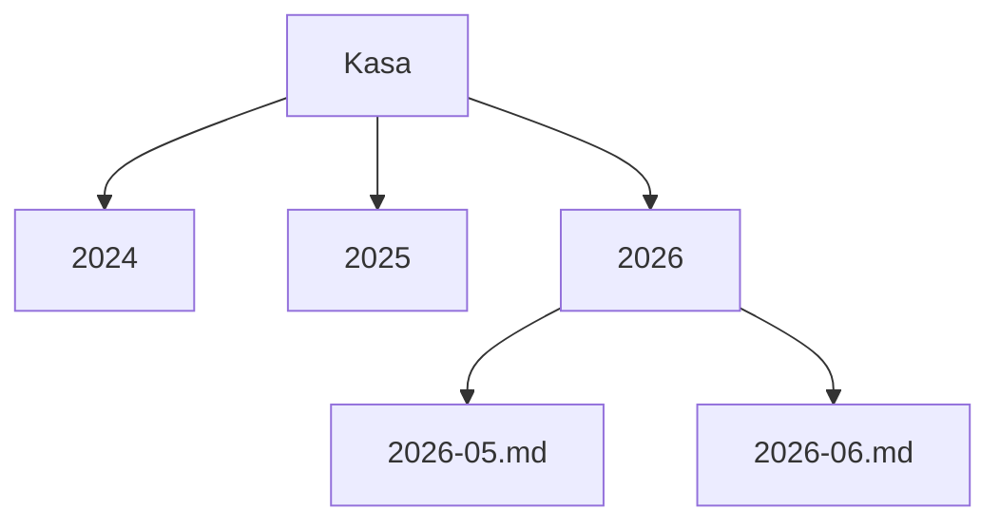
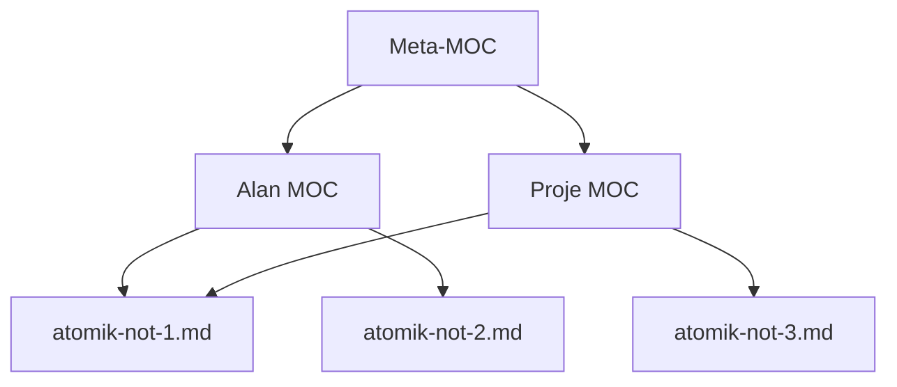

# Klasör Disiplini ve Maps of Content (MOC) Kalıbı

Önceki broşür, Kasa Olarak Hafıza kalıbının dört adımını kurmuştu. Bu broşür, o dört adımdan Store adımını derinleştirir. Bilginin nereye ait olduğu sorusu, yüzeyde basit görünür ama bir mühendislik kararıdır. Yanlış bir klasör mimarisi, aylar içinde bir araştırmacıya gizli bir verimlilik vergisi koyar. Doğru bir mimari, dosya bulmayı kavramsal hatırlamadan yapısal navigasyona taşır. Hedef, bir klasör mimarisini bir kişisel zevk değil, bir tasarım kararı olarak ele almak ve içerik haritası kalıbını sosyal bilim bağlamına uyarlamaktır.

## 1. Klasör Seçiminin Maliyet Hesabı

Bir akademisyen kasasını kurarken klasör mimarisini çoğu zaman düşünmeden seçer. İlk akla gelen yapı kurulur, dosyalar atılır, çalışmaya başlanır. Bu seçim ucuz görünür, ama gerçek maliyeti zamanla ortaya çıkar. Altı ay sonra, bir araştırmacı bir dosyayı aradığında onu nerede bıraktığını hatırlamak zorunda kalır. Bir yıl sonra, aynı belge iki farklı klasörde iki farklı adla durur. İki yıl sonra, kasanın yarısı erişilemez hale gelir, çünkü hangi bilginin nerede olduğu artık belirsizdir.

Bu maliyet, doğrudan görünmediği için gizli bir vergidir. Her yanlış yerleştirilen dosya, gelecekte bir arama maliyeti doğurur. Norman'ın (2013) gündelik nesnelerin tasarımı üzerine ortaya koyduğu temel ilke, burada doğrudan geçerlidir. Bir sistemin kullanılabilirliği, kullanıcının onu kullanırken ne kadar düşünmek zorunda kaldığıyla ters orantılıdır. İyi tasarlanmış bir kasa, araştırmacının dosya bulmak için düşünmesini gerektirmez, çünkü yapı kendisi yolu gösterir. Bu broşür, o yapıyı kurmanın ilkelerini sunar. Klasör disiplini bir estetik tercih değil, gelecekteki erişim maliyetini bugünden düşüren bir mühendislik yatırımıdır.

## 2. Üç Yaygın Mimarinin Karşılaştırılması

Akademik kasalarda üç temel klasör mimarisi yaygındır. Her birinin bir mantığı ve bir maliyeti vardır.

Birincisi, konu bazlı mimaridir. Klasörler, araştırma alanlarına göre düzenlenir. Klinik notlar bir klasörde, saha çalışması başka bir klasörde, literatür üçüncü bir klasörde.



İkincisi, kronolojik mimaridir. Klasörler, zamana göre düzenlenir. Her yıl bir klasör, her ay bir alt klasör. Bu mimari günlük tutma için doğaldır, ama bir bilginin konu bağlamını gizler.



Üçüncüsü, proje bazlı mimaridir. Klasörler, aktif projelere göre düzenlenir. Bu mimari kısa vadede verimlidir, ama akademik üretimin uzun ömürlü doğasıyla çelişir, çünkü bir proje biter ama ürettiği bilgi kalır. Bu üç mimarinin hiçbiri tek başına yeterli değildir. Konu bazlı mimari zamanı, kronolojik mimari konuyu, proje bazlı mimari kalıcılığı gizler. Çözüm, bunlardan birini seçmek değil, bir navigasyon katmanı eklemektir. O katman, içerik haritasıdır.

## 3. PARA, Zettelkasten ve Johnny Decimal

Üç popüler organizasyon kalıbı, akademik kasa tasarımına ışık tutar, ama hiçbiri olduğu gibi yeterli değildir.

PARA kalıbı, Tiago Forte'nin (2022) önerdiği bir sistemdir. Projeler, Alanlar, Kaynaklar, Arşiv. Bu kalıp, bilgiyi eyleme yakınlığına göre düzenler. PARA, kişisel verimlilik için güçlüdür, ama akademik üretim için olduğu gibi yetersizdir. Sorun şudur. Akademik bir kasada bir makale, bir Proje olarak başlar, sonra bir Kaynak olur, on yıl sonra bir Arşiv olur. PARA bu yaşam döngüsünü yakalar ama bu döngü boyunca dosyanın taşınması gerekir, bu da bir sürtünme yaratır. Zettelkasten kalıbı, Sönke Ahrens'in (2017) popülerleştirdiği atomik not sistemidir. Bu kalıp, her notun tek bir düşünce taşıdığı ve notların birbirine bağlandığı bir ağ kurar. Zettelkasten, fikir geliştirme için güçlüdür, ama büyük belge koleksiyonlarının yönetimi için tek başına yetersizdir.

Johnny Decimal kalıbı, klasörleri numaralı bir ondalık sistemle düzenler. Bir alan 10-19, bir alt alan 11, bir belge 11.01. Bu kalıp, navigasyonu sayısal ve kesin kılar. Akademik bir kasa için Johnny Decimal'in değeri, klasör adlarına gömülü bir sıralama ve bir adres sistemi getirmesidir. Bu üç kalıbın sosyal bilim için uygunluk haritası şudur. PARA yaşam döngüsünü, Zettelkasten fikir bağlantısını, Johnny Decimal navigasyonu güçlendirir. En sağlam akademik kasa, bu üçünün güçlü yanlarını birleştirir. Numaralı klasörler, atomik notlar ve bunları birbirine bağlayan içerik haritaları. Allen'ın (2015) işleri tamamlama yöntemiyle ortaya koyduğu temel ilke de buraya katkı yapar. Bir sistem, ancak güvenilir olduğunda zihinsel yükü azaltır. Akademisyenin kasaya güvenebilmesi, yapının tutarlılığına bağlıdır.

## 4. MOC, İçerik Haritası Kalıbı

İçerik haritası, yani Maps of Content, bir kasanın navigasyon omurgasıdır. Bir içerik haritası, bir konuya açılan kapıdır. İlgili belgeleri tek bir yerde toplar, aralarında kısa bir bağlam sağlar ve okuru doğru belgeye yönlendirir. İçerik haritası bir klasör değildir, bir belgedir. Klasörler dosyaları fiziksel olarak gruplar, içerik haritaları ise dosyaları kavramsal olarak gruplar. Bu ayrım kritiktir, çünkü bir dosya tek bir klasörde durur ama birden çok içerik haritasında görünebilir.

İçerik haritasının niçin gerekli olduğu, ikinci bölümdeki üç mimarinin sınırından gelir. Klasör mimarisi tek boyutludur, bir dosya bir klasördedir. Ama bilgi çok boyutludur, bir vaka notu hem klinik alanına hem belirli bir projeye hem de belirli bir kurama ait olabilir. İçerik haritası, bu çok boyutluluğu yakalar. Bates'in (2002) bilgi arama ve tarama davranışının bütünleşik modeli, bu noktayı destekler. Araştırmacılar bilgiyi tek bir doğrusal yolla değil, birbirine bağlı birçok giriş noktasından arar. İçerik haritası, bu giriş noktalarını somutlaştırır.

İçerik haritasının nasıl kurulduğu basittir. Bir konu seçilir, o konuyla ilgili belgeler listelenir, her belgeye kısa bir bağlam cümlesi eklenir ve harita bir giriş paragrafıyla çerçevelenir. Tufte'nin (1990) bilgiyi görselleştirme üzerine ortaya koyduğu ilkeler burada uygulanır. İyi bir harita, gereksiz süslemeden arınmış, bilgi yoğunluğu yüksek ve göz için okunabilir olmalıdır. Bir içerik haritası, bir kasanın görünür yapısıdır.

## 5. Atomik Not, MOC, Meta-MOC Hiyerarşisi

İçerik haritaları tek bir düzeyde kalmaz, bir hiyerarşi oluşturur. Bu hiyerarşi üç katmanlıdır.



En alt katman atomik nottur. Bir atomik not, tek bir düşünce, tek bir kaynak ya da tek bir gözlem taşır. Atomik notlar kasanın yapı taşlarıdır. Orta katman içerik haritasıdır. Bir içerik haritası, ilgili atomik notları bir konu altında toplar. En üst katman meta içerik haritasıdır, yani meta-MOC. Bir meta-MOC, içerik haritalarını toplar, kasanın en üst düzey navigasyon kapısıdır. Bir araştırmacı kasaya girdiğinde önce meta-MOC'u açar, oradan ilgili alan haritasına, oradan da belirli bir atomik nota iner.

Bu hiyerarşinin gücü, aynı atomik notun birden çok içerik haritasında görünebilmesidir. Diyagramda görüldüğü gibi, atomik-not-1 hem Alan MOC'ta hem Proje MOC'ta yer alır. Bu, klasör mimarisinin tek boyutluluğunu aşar. Dosya fiziksel olarak tek bir klasörde durur, ama kavramsal olarak birden çok haritada yaşar. Hiyerarşi, kasayı bir dosya yığınından gezilebilir bir bilgi alanına dönüştürür.

## 6. Markdown Sözleşmeleri

Bir kasanın tutarlılığı, küçük ama disiplinli sözleşmelere dayanır. Bu sözleşmeler, kasanın her belgesinde aynı kuralların uygulanmasını sağlar.

| Öğe | Sözleşme | Örnek |
|---|---|---|
| Dosya adı | İngilizce, küçük harf, tire ile ayrık | `klinik-vaka-formulasyonu.md` |
| Başlık | Türkçe, frontmatter `title` alanında | `title: "Vaka Formülasyonu"` |
| Dahili bağlantı | Köşeli çift parantez | `[[komotini-saha-2025]]` |
| Etiket | frontmatter listesi | `etiketler: [klinik, formulasyon]` |
| Tarih | ISO 8601 biçimi | `2026-05-24` |
| Başlık düzeyi | Tek bir birinci düzey başlık | `# Belge Başlığı` |

Bu sözleşmelerin en önemlisi, dosya adı ile başlık arasındaki ayrımdır. Dosya adı İngilizce ve sade tutulur, Türkçe başlık frontmatter içinde yaşar. Bu ayrımın nedeni, bir sonraki bölümün konusu olan Unicode meselesidir. Köşeli çift parantez bağlantıları, önceki broşürde anlatılan hipertekst ilkesinin somut uygulamasıdır. Bir belge başka bir belgeye atıf verdiğinde, bu atıf gezilebilir bir bağlantı olur. Frontmatter etiketleri, makinenin kasayı sorgulamasını sağlar. Bir araştırmacı, belirli bir etikete sahip tüm belgeleri tek bir komutla toplayabilir.

## 7. Örnek Akademik Kasa, Üç MOC Tipi

Somut bir örnek, kalıbı netleştirir. On yıllık pratiği olan bir klinik psikoloğun kasasını ele alalım. Bu kasada üç tip içerik haritası bulunur.

Birincisi, proje içerik haritasıdır. Aktif bir araştırma projesini yönetir.

```text
---
tip: moc-proje
etiketler: [moc, sosyal-kaygi-calismasi]
---
# Sosyal Kaygı Çalışması MOC

Bu harita, devam eden sosyal kaygı araştırmasının tüm belgelerini toplar.

- [[sosyal-kaygi-literatur-derleme]] literatür taraması özeti
- [[komotini-saha-2025]] saha verisi notları
- [[analiz-plani-v2]] güncel analiz planı
```

İkincisi, alan içerik haritasıdır. Bir uzmanlık alanını uzun vadede izler.

```text
---
tip: moc-alan
etiketler: [moc, klinik-formulasyon]
---
# Klinik Formülasyon Alanı MOC

Vaka formülasyonu üzerine biriken tüm kavramsal notlar.

- [[biyo-psiko-sosyal-model]] kuramsal çerçeve
- [[formulasyon-sablonu]] standart şablon
```

Üçüncüsü, arşiv içerik haritasıdır. Tamamlanmış projeleri korur. Bir proje bittiğinde, proje haritası arşiv haritasına bağlanır, ama belgeler silinmez. Bu üç tip birlikte, Forte'nin (2022) PARA yaşam döngüsünü içerik haritası katmanıyla zenginleştirir. Bir proje, proje haritasından başlar, alan haritasında olgunlaşır, arşiv haritasında korunur. Belge hiç taşınmaz, sadece haritalardaki görünürlüğü değişir. Bu, PARA'nın taşıma sürtünmesini ortadan kaldırır.

## 8. Tool Değişikliklerine Dayanım

Bir kasanın uzun ömrü, hiçbir tek araca bağlı olmamasına dayanır. Bir araştırmacı kasasını bugün bir not uygulamasında tutabilir, ama o uygulama beş yıl sonra kapanabilir ya da fiyatlandırma politikası değişebilir. Kasa, bu değişime dayanmalıdır. Dayanımın temeli, düz metin Markdown ilkesidir. İçerik haritaları, köşeli parantez bağlantıları ve frontmatter, hepsi düz metin sözleşmeleridir. Bunlar belirli bir uygulamaya değil, Markdown standardına bağlıdır.

Pratik test şudur. Bir kasa, en sevdiğiniz uygulamadan çıkarılıp sade bir metin editöründe açıldığında hâlâ gezilebilir mi. İyi tasarlanmış bir kasada yanıt evettir, çünkü bağlantılar metin içinde görünür, haritalar okunabilir belgelerdir, etiketler düz metin alanlarıdır. Bir araç değiştiğinde kaybolan tek şey, o aracın sunduğu görsel kolaylıklardır, kasanın kendisi değil. Bu dayanım, kasayı on yıl ölçeğinde güvenilir kılar.

## 9. Türkiye ve Yunanistan Özgüllüğü

Türkçe ve Yunanca dosya adları, teknik bir tuzak barındırır. Türkçe karakterler, özellikle ğ, ü, ş, ı, ö, ç, dosya adlarında kullanıldığında işletim sistemleri arasında sorun çıkarabilir. Bunun nedeni, Unicode normalizasyonunun farklı sistemlerde farklı çalışmasıdır. macOS dosya sistemi karakterleri bir biçimde, yani NFD'de saklarken, Linux başka bir biçimde, yani NFC'de bekler. Bir kasa git üzerinden bu iki sistem arasında taşındığında, Türkçe karakterli dosya adları bozulabilir ya da çoğaltılabilir.

Çözüm basit ve önceki sözleşmelerde zaten kuruludur. Dosya adları İngilizce ve sade tutulur, Türkçe başlık frontmatter içindeki `title` alanında yaşar. Örneğin bir belge `sosyal-kaygi-derleme.md` adıyla saklanır, ama frontmatter'ında `title: "Sosyal Kaygı Derlemesi"` bulunur. Bu kural hem teknik sorunu çözer hem de uluslararası iş birliğini kolaylaştırır, çünkü İngilizce dosya adları farklı dil ortamlarında güvenle taşınır. Aynı kural Yunanca için de geçerlidir, αβγ karakterleri yerine Latin harfli sade dosya adları kullanılır. Bu, derin teknik bir tartışma değil tek bir disiplin kuralıdır, ayrıntılı sorun giderme kapanış broşürüne bırakılır.

## 10. Köprü, Atıf Disiplinine

Klasör mimarisi kurulduktan sonra, içine giren her referansın bibliyografik temizliği, kasanın uzun ömrünü belirler. Bir kasa ne kadar iyi düzenlenirse düzenlensin, içindeki atıflar tutarsızsa, akademik üretim güvenilir olmaz. Bir sonraki kategori, APA 7 ve DOI disiplinini ele alır, her referansın doğru, doğrulanmış ve tutarlı biçimde nasıl tutulacağını gösterir. Knuth'un (1984) edebi programlama felsefesi, bu broşürün de temelidir. Belgenizi insan okuyabilsin diye yazın, makinenin onu okuyabilmesini ek bir özellik olarak kabul edin. Brown ve Duguid'in (2017) bilginin sosyal yaşamı üzerine gösterdiği gibi, bir kasa yalnızca dosya deposu değil, içinde bilginin bağlamıyla yaşadığı bir ortamdır.

## Kaynakça

Ahrens, S. (2017). *How to take smart notes: One simple technique to boost writing, learning and thinking*. ISBN 978-1542866507

Allen, D. (2015). *Getting things done: The art of stress-free productivity* (gözden geçirilmiş baskı). Penguin Books. ISBN 978-0-14-312656-9

Bates, M. J. (2002). Toward an integrated model of information seeking and searching. *New Review of Information Behaviour Research*, 3(1), 1-15.

Brown, J. S., & Duguid, P. (2017). *The social life of information* (güncellenmiş baskı, yeni önsözle). Harvard Business Review Press. ISBN 978-1-63369-241-1

Forte, T. (2022). *Building a second brain: A proven method to organize your digital life and unlock your creative potential*. Atria Books. ISBN 978-1-9821-6738-9

Knuth, D. E. (1984). Literate programming. *The Computer Journal*, 27(2), 97-111. https://doi.org/10.1093/comjnl/27.2.97

Norman, D. A. (2013). *The design of everyday things* (gözden geçirilmiş ve genişletilmiş baskı). Basic Books. ISBN 978-0-465-05065-9

Tufte, E. R. (1990). *Envisioning information*. Graphics Press. ISBN 978-0-9613921-1-6

---

**Broşür kimliği.** `004-01-0001`
**Sürüm.** `0.1.0`
**Tarih.** 2026-05-24
**Sözcük sayısı (yaklaşık).** 1745 (Türkçe gövde metni, wc ile ölçüldü)
**Doğrulanmış atıf sayısı.** 8
**Halüsinasyon atıf sayısı.** 0
**Önceki broşür.** [`003-01-0001`](../../003-memory-system/003-01-0001/tr.md). Kasa Olarak Hafıza, İlkesel Bir Giriş
**Sonraki broşür.** [`007-02-0001`](../../007-academic-writing/007-02-0001/tr.md). DOI Disiplini ile APA 7
